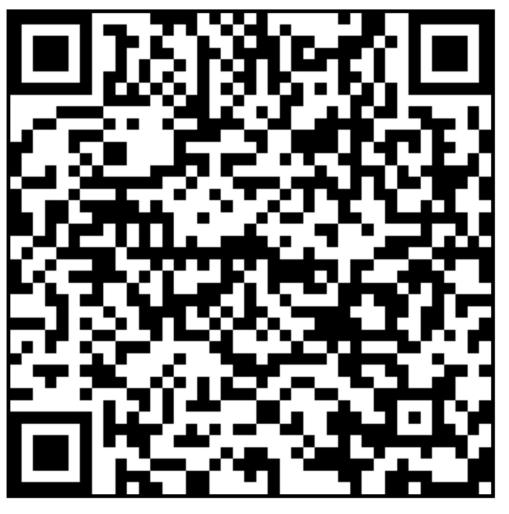
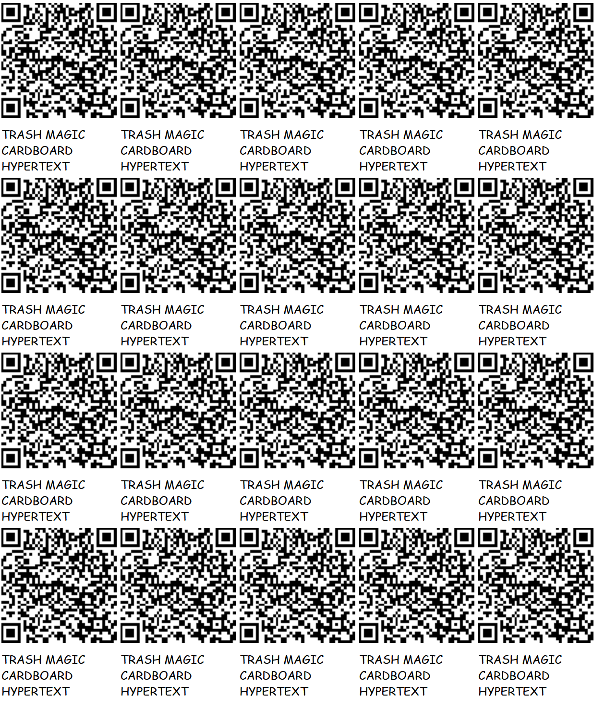
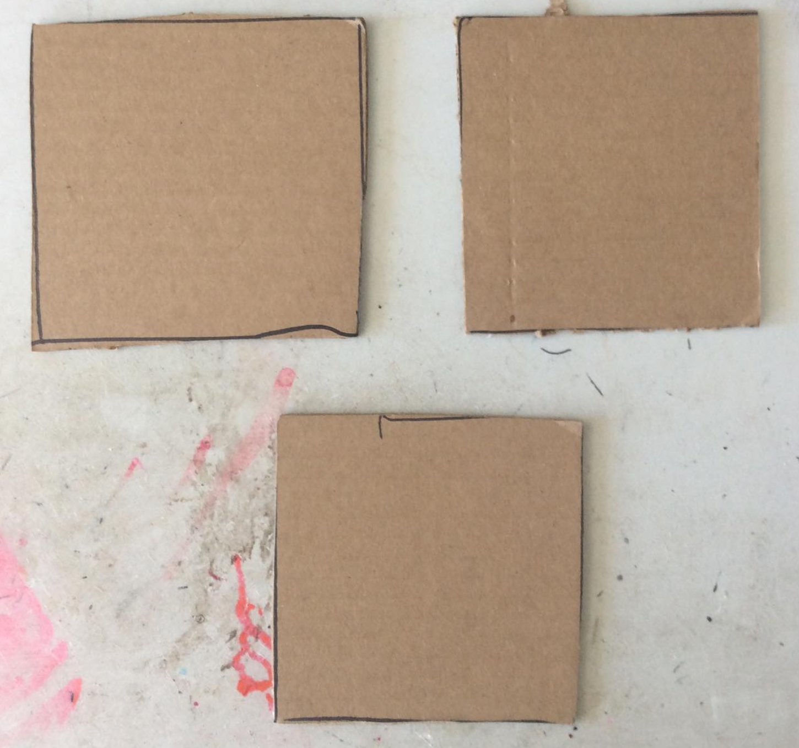
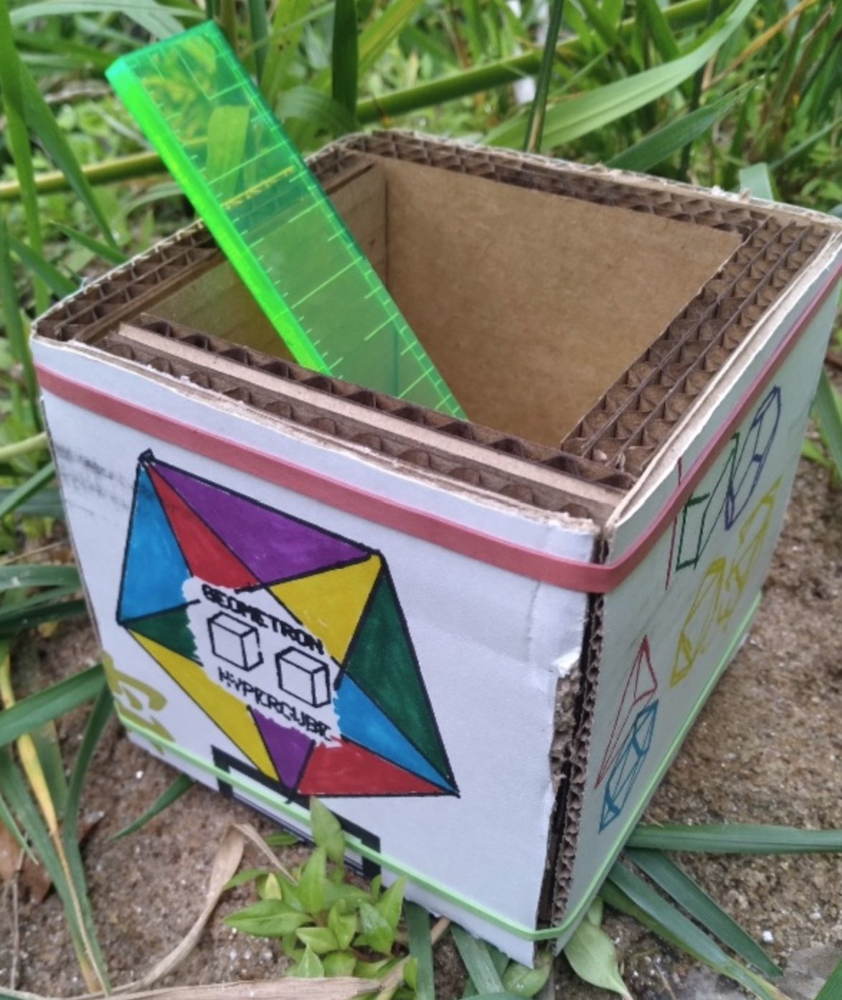
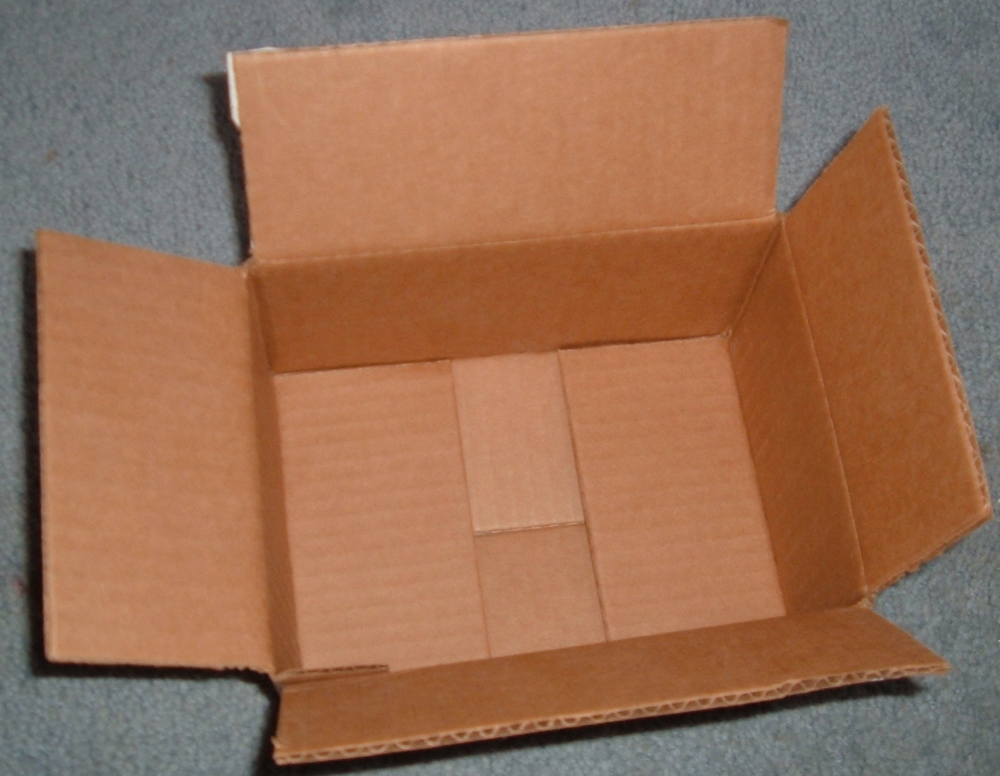

## [http://localhost/CARDBOARD-HYPERTEXT/](http://localhost/CARDBOARD-HYPERTEXT/)

# [CARDBOARD HYPERTEXT](https://github.com/LafeLabs/CARDBOARD-HYPERTEXT)

WHEN CARDBOARD HAS QR CODES OR URLS ON IT, CARDBOARD BECOMES HYPERTEXT!

WHEN THE WEB POINTS TO PLACES WHERE CARDBOARD FLOWS ALONG THE [STREET NETWORK](https://github.com/LafeLabs/STREET-NETWORK), THE WEB EXTENDS INTO THE STREETS!

## ELEMENTS OF THE SYSTEM

 - CARDBOARD SIGNS
 - 3 INCH BY 5 INCH CARDBOARD CARDS
 - 4 INCH CARDBOARD SQUARES
 - GEOMETRON HYPERCUBE
 - CARDBOARD BOXES
 - TRASH CLOUD WEB PAGES
 - QR CODES

## CARDBOARD SIGNS

## 3X5 INCH CARDBOARD CARDS

## 4 INCH CARDBOARD SQUARES

## GEOMETRON HYPERCUBE

## CARDBOARD BOXES

## TRASH MAGIC CLOUD WEB

 - [WWW.TRASHROBOT.NET](HTTPS://WWW.TRASHROBOT.NET)

## QR CODES

 - [qrcode.html](qrcode.html)
 - [qrcode-page.html](qrcode-page.html)